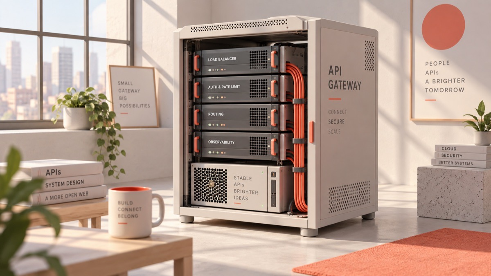

# GPT Image 2.5 API 한국어 가이드（gpt-image-2.5 / gptimage2.5）

<p align="center">
  
</p>

> 종량제, 최소 1달러 충전, OpenAI 호환 엔드포인트. **flare@1K $0.0085; sunburst@1K $0.0085; flare@2K $0.014**

**[模型页](https://go.apimart.ai/k-753c3e) · [实时价格](https://go.apimart.ai/k-a0ec37) · [获取 API Key](https://go.apimart.ai/k-726428)**

## 가격（快照 2026-09-24）

| 档位 | 单价 |
| --- | --- |
| `flare@1K` | $0.0085 |
| `sunburst@1K` | $0.0085 |
| `flare@2K` | $0.014 |
| `sunburst@2K` | $0.014 |

按量计费、**$1 起充**，无订阅、无免费额度；每次任务响应返回 `cost` / `credits_cost`。

## 调用示例

```bash
curl --request POST --url https://api.apimart.ai/v1/images/generations \
  --header "Authorization: Bearer $APIMART_API_KEY" --header 'Content-Type: application/json' \
  --data '{"model":"gpt-image-2.5-ext","prompt":"海边悬崖的现代别墅，黄昏","size":"16:9","n":1}'
```

## 披露

이 저장소는 서드파티 중계 서비스 APIMart 사용 가이드입니다.
